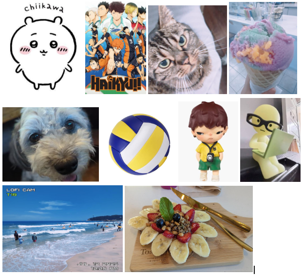

# Me in Markdown
|**Letter to Teacher**|
|-|
**Hi my name is Julia and I’m in 9th grade. I am half Korean, a quarter American and Mexican.**
# About Me
    Travel ✈️
 I enjoy traveling with my family and have been to *many* places. I’ve been to DisneyWorld in Florida, a few cities in Italy, Japan, Hawaii, and Korea. During the summer I took a trip to Lake Arrowhead and stayed there for 3 days and 2 nights. There was a lot to see and do so it was fun and I would definitely want to come again. The first day we arrived and planned out what we would do for the next few days. The second day we took a boat tour around the lake where a guide would tell us all about the landmarks and history of the lake. The tour guide was very enthusiastic so it was quite entertaining. The rest of the day we went shopping and went down to the beach at sunset. The last day we packed and went kayaking on the lake for about an hour. As it was my first time, I was a little nervous but actually found it much easier than I expected. After kayaking we went on a couple hikes around the area. I was expecting a lot of people, but it was actually really quiet and peaceful. Ironically, the next week I would be going to Big Bear (on the other side of Lake Arrowhead) for a church retreat where I would stay for 3 days and 2 nights again. My summer this year was quite fun !

    Fun Fact 🌟
A fun fact about me is that I play <u>4 different instruments</u> that are the piano, violin, 12-string gayageum and the 25-string gayageum. I recently started learning the gayageum(a Korean traditional instrument), but have played the piano and violin for over 3 years. I like the gayageum most because it’s the easiest to play and sounds really nice when you know how to play. However, the gayageum is about 5 feet long, which makes it hard to carry to performances. I perform and do competitions every few months and am planning to major in Ethnomusicology at UCLA.

    Favorite Movie 🌀
My favorite movie series is Avatar by James Cameron(specifically The Way of Water). It’s my favorite movie series because they are well thought out, have good characters, and the storyline is interesting. Another reason is because Avatar is known for its amazing graphics and beautiful scenes. It’s also my mom’s favorite movie series.

# Spodify Playlist
I recently made this playlist for summer during my trips, hope you enjoy it!

[Click here to view my playlist ! ♪♪♪](https://shorturl.at/uFS86)

Here are my raitings of some songs from the playlist ->>>

|song|artist|rating|
|-|-|-|
|Beaches|Beabadoobee|10/10|
|4Me 4Me|Malcom Todd|7/10|
|I Saw Your Face|Malcom Todd|4/10|
|

# Collage
Here is a collage of some of the things I like in my life ! <3

